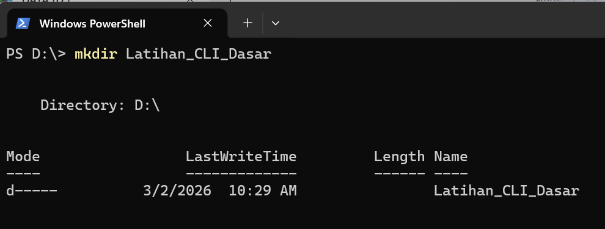
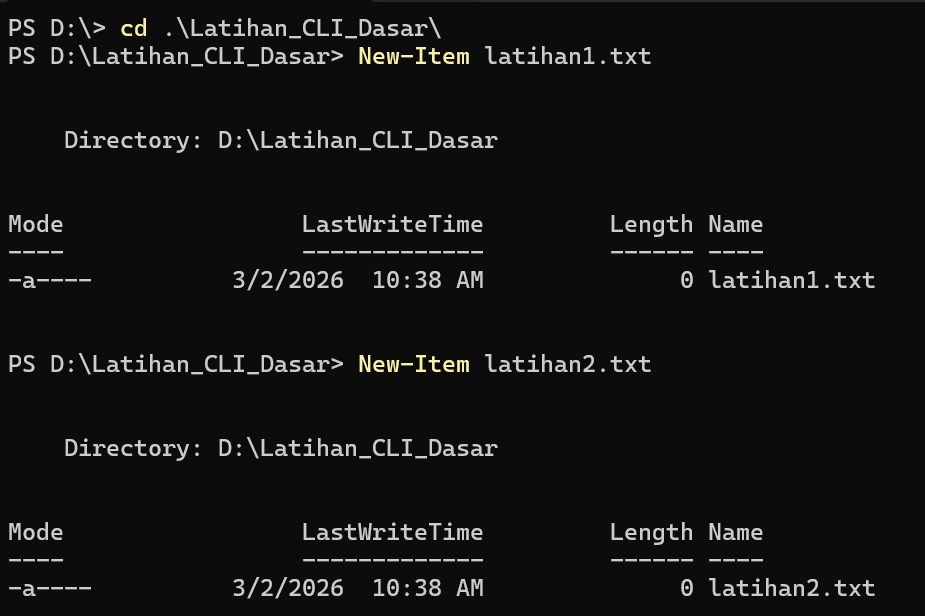
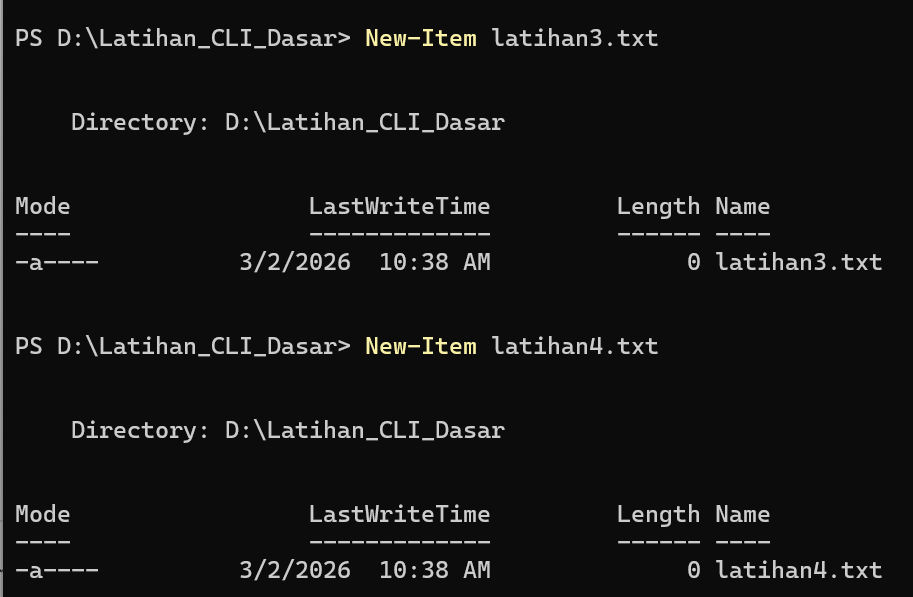
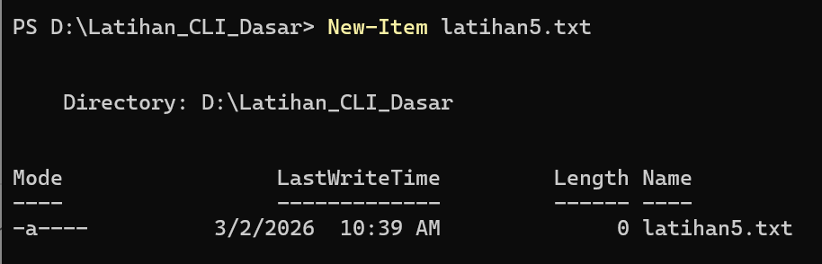
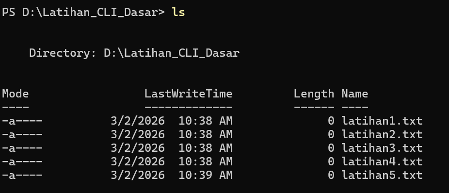
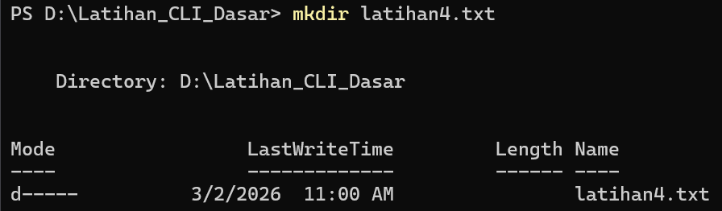
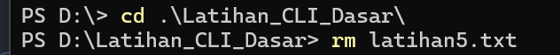
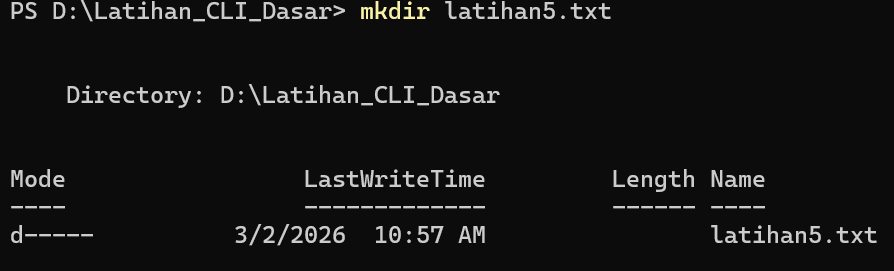
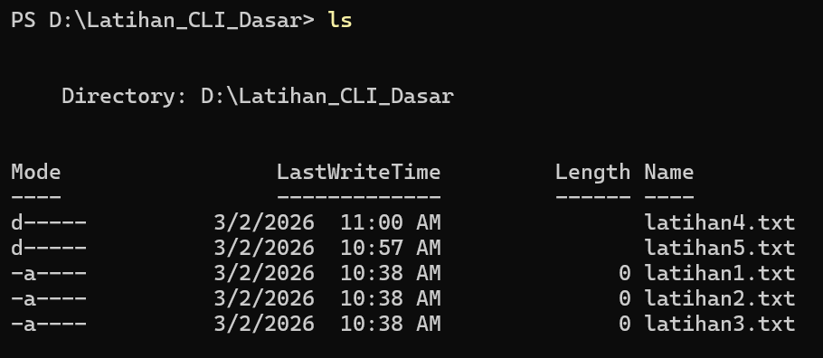
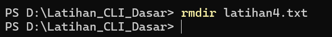

# Minitask CLI
1. Membuat folder

2. Membuat file Kosong

3. Melihat daftar file

4. Menghapus file urutan ke-4

5. Membuat folder "latihan4.txt"

6. Menghapus file urutan ke-5

7. Membuat folder "latihan5.txt"

8. Melihat daftat file dan folder

9. Menghapus folder "latihan4.txt"

